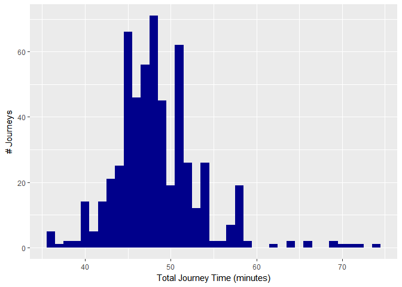
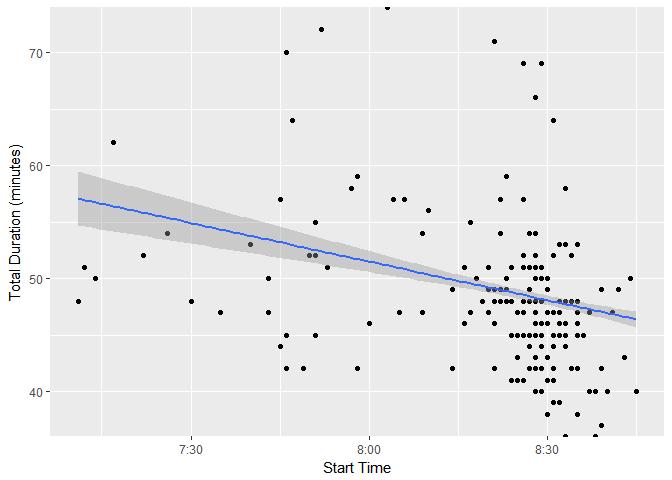
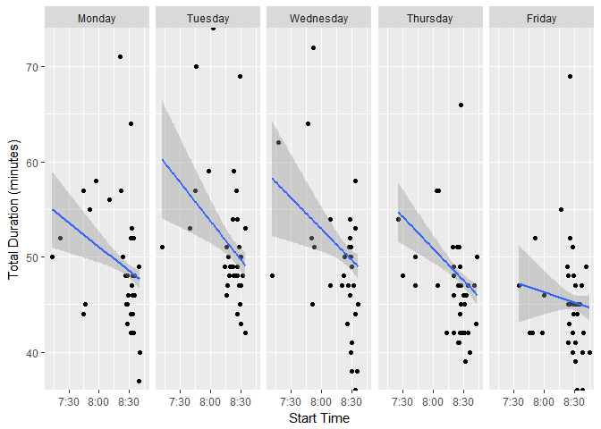
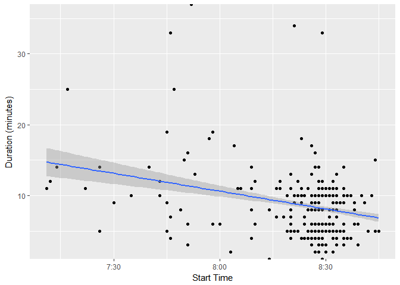

## Libraries


```r
require(dplyr)
require(lubridate)
require(data.table)
require(ggplot2)
require(stringr)
require(DiagrammeR)
```

## TODO: summary

## TODO: data structure and point map


```r
mermaid("graph LR; A-->B; A-->C; C-->E; B-->D; C-->D; D-->F; E-->F")
```

<!--html_preserve--><div id="htmlwidget-fba29d035f1a907476de" style="width:672px;height:480px;" class="DiagrammeR html-widget"></div>
<script type="application/json" data-for="htmlwidget-fba29d035f1a907476de">{"x":{"diagram":"graph LR; A-->B; A-->C; C-->E; B-->D; C-->D; D-->F; E-->F"},"evals":[],"jsHooks":[]}</script><!--/html_preserve-->


```r
DiagrammeR::grViz("
  digraph commutemap {
graph [layout = circo]
  rankdir='LR'
  {
    node [shape=box]
    S [label='Start']
    EX [label='Express Way']
    E [label='End']
  }
    S -> EX -> E
  }
  ")
```

<!--html_preserve--><div id="htmlwidget-ad836c675660934d2bba" style="width:672px;height:960px;" class="grViz html-widget"></div>
<script type="application/json" data-for="htmlwidget-ad836c675660934d2bba">{"x":{"diagram":"\n  digraph commutemap {\ngraph [layout = circo]\n  rankdir=\"LR\"\n  {\n    node [shape=box]\n    S [label=\"Start\"]\n    EX [label=\"Express Way\"]\n    E [label=\"End\"]\n  }\n    S -> EX -> E\n  }\n  ","config":{"engine":"dot","options":null}},"evals":[],"jsHooks":[]}</script><!--/html_preserve-->


## Load The Data


```r
unzip("data/export-150817.zip", exdir="unpacked")
unzip("data/export-171017.zip", exdir="unpacked")
unzip("data/export-300118.zip", exdir="unpacked")
unzip("data/export-130718.zip", exdir="unpacked")
unzip("data/export-211218.zip", exdir="unpacked")
```

## Preprocess The Data


```r
# function to extract date & time from raw data
readdata <- function(f) {
  fread(f, select=c(1), col.names=c("datetime"))
}

# create data frames for start, express way and end points reached
start <- rbindlist(lapply(list.files(path="unpacked", pattern="start.csv", full.names = TRUE, recursive = TRUE), readdata))
expressway <- rbindlist(lapply(list.files(path="unpacked", pattern="expressway.csv", full.names = TRUE, recursive = TRUE), readdata))
end <- rbindlist(lapply(list.files(path="unpacked", pattern="end", full.names = TRUE, recursive = TRUE), readdata))
```

```
## Warning in fread(f, select = c(1), col.names = c("datetime")): Stopped
## early on line 2. Expected 1 fields but found 1. Consider fill=TRUE and
## comment.char=. First discarded non-empty line: <<>>
```

```r
# column names
colnames(start) <- c("RawDateTime")
colnames(expressway) <- c("RawDateTime")
colnames(end) <- c("RawDateTime")

# convert date into date and time
start$Date <- as.Date(start$RawDateTime, format("%b %d, %Y at %H:%M%p"))
start$DateTime <- as.POSIXct(start$RawDateTime, format="%b %d, %Y at %H:%M%p")
start <- subset(start, select=c(2:3))

expressway$Date <- as.Date(expressway$RawDateTime, format("%b %d, %Y at %H:%M%p"))
expressway$DateTime <- as.POSIXct(expressway$RawDateTime, format="%b %d, %Y at %H:%M%p")
expressway <- subset(expressway, select=c(2:3))

end$Date <- as.Date(end$RawDateTime, format("%b %d, %Y at %H:%M%p"))
end$DateTime <- as.POSIXct(end$RawDateTime, format="%b %d, %Y at %H:%M%p")
end <- subset(end, select=c(2:3))

# combine into one tidy data set where each row is a journey

# join together by date
start_to_expressway <- inner_join(start, expressway, by=c("Date" = "Date"), suffix=c(".start", ".xway"))
journeys <- inner_join(start_to_expressway, end, by=c("Date" = "Date"))
colnames(journeys) <- c("Date", "Start", "ExpressWay", "End")

# TODO explain outliers
# remove outliers (all should be between 6am and 10am) and bad readings
journeys <- subset(journeys, am(journeys$Start) & hour(journeys$Start) > 6 & hour(journeys$Start) < 9 & hour(journeys$End) < 10 & am(journeys$End))
journeys <- subset(journeys, journeys$Start < journeys$End)
journeys <- subset(journeys, journeys$ExpressWay < journeys$End)
journeys <- subset(journeys, journeys$ExpressWay > journeys$Start)

# add segment travel times
journeys$StartToExpressWay <- difftime(journeys$ExpressWay, journeys$Start)
journeys$ExpressWayToEnd <- difftime(journeys$End, journeys$ExpressWay)
journeys$Total <- difftime(journeys$End, journeys$Start)

# remove journeys longer than 90 minutes (these usually involve errands on the way to work)
journeys <- subset(journeys, journeys$Total <= 90)

# add start time for convenience
journeys$StartTime <- as.numeric(journeys$Start-trunc(journeys$Start, "days"))

# add day of week as ordered factor
journeys$dow <- factor(weekdays(journeys$Date), levels=c("Monday", "Tuesday", "Wednesday", "Thursday", "Friday", "Saturday", "Sunday"))

head(journeys)
```

```
##         Date               Start          ExpressWay                 End
## 1 2016-12-01 2016-12-01 08:04:00 2016-12-01 08:44:00 2016-12-01 09:01:00
## 2 2016-12-02 2016-12-02 07:51:00 2016-12-02 08:40:00 2016-12-02 08:43:00
## 3 2016-12-05 2016-12-05 07:45:00 2016-12-05 08:33:00 2016-12-05 08:42:00
## 4 2016-12-06 2016-12-06 07:45:00 2016-12-06 08:23:00 2016-12-06 08:42:00
## 5 2016-12-07 2016-12-07 07:53:00 2016-12-07 08:31:00 2016-12-07 08:44:00
## 6 2016-12-08 2016-12-08 08:06:00 2016-12-08 08:52:00 2016-12-08 09:03:00
##   StartToExpressWay ExpressWayToEnd   Total StartTime       dow
## 1           40 mins         17 mins 57 mins  8.066667  Thursday
## 2           49 mins          3 mins 52 mins  7.850000    Friday
## 3           48 mins          9 mins 57 mins  7.750000    Monday
## 4           38 mins         19 mins 57 mins  7.750000   Tuesday
## 5           38 mins         13 mins 51 mins  7.883333 Wednesday
## 6           46 mins         11 mins 57 mins  8.100000  Thursday
```


```r
format_time <- function(time) {
  hours <- floor(time)
  minutes <- (time - floor(time)) * 60
  minutes <- floor(minutes)
  minutes <- str_pad(minutes, 2, side="left", pad="0")
  formatted <- paste(hours,minutes,sep=":")
  return(formatted)
}
```


## Plots

# Total Journey Time Variation

```r
ggplot(journeys, aes(x = as.numeric(Total))) + geom_histogram(binwidth=1, fill="darkblue") + ylab("# Journeys") + xlab("Total Journey Time (minutes)")
```

<!-- -->


# Total Journey Time By Start Time


```r
ggplot(journeys, aes(StartTime, Total)) + geom_point() + geom_smooth(method="lm") + scale_y_continuous(expand = c(0,0)) + scale_x_continuous(labels=format_time) + ylab("Total Duration (minutes)") + xlab("Start Time")
```

<!-- -->


# Total Journey Time By Start Time For Each Day Of The Week


```r
ggplot(journeys, aes(StartTime, Total)) + geom_point() + geom_smooth(method="lm") + facet_grid(.~dow) + scale_y_continuous(expand = c(0,0)) + scale_x_continuous(labels=format_time) + ylab("Total Duration (minutes)") + xlab("Start Time")
```

<!-- -->

# Time Taken from Express Way to Work by Start Time


```r
ggplot(journeys, aes(StartTime, ExpressWayToEnd)) + geom_point() + geom_smooth(method="lm") + scale_y_continuous(expand = c(0,0)) + scale_x_continuous(labels=format_time) + ylab("Duration (minutes)") + xlab("Start Time")
```

<!-- -->
